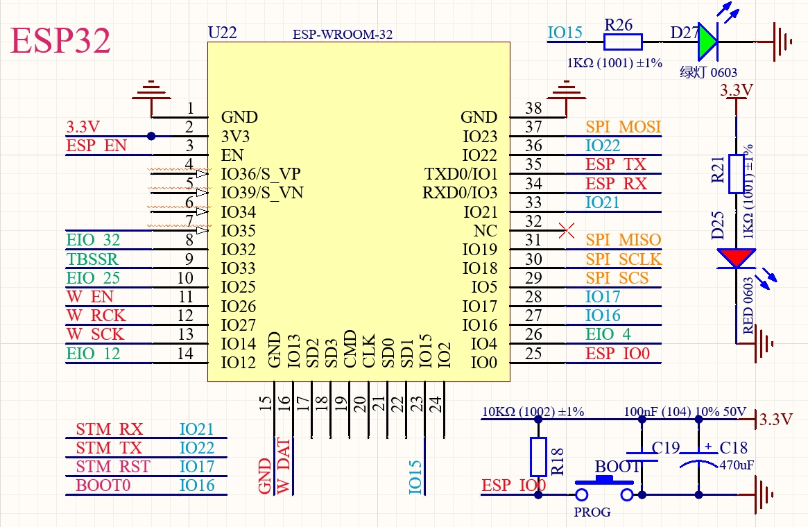

REMOTE_KEY_V1.1

**ESP32-WROOM-32D**

-   板载 W5500、HC595、STM32 芯片均与 ESP32 连接，详见下图 Layout 及板上丝印。

**STM32F103C8T6**

-   由于 STM32 的 `RESET` 和 `BOOT0` 被 ESP32 用于 ISP 升级,当使用 STLINK 开发调试 STM32 时，需避免被 ESP32 干扰

    -   方法 1：保证 ESP32 的程序中 `IO16`、`IO17` 是悬空状态
    -   方法 2：通过按住板载按钮【BOOT】不放再按板载按钮【RST】使 ESP32 进入下载等待状态，此时 `IO16`、`IO17` 自然也被释放了。【此时板载绿灯处于微亮状态！】
    -   方法 3：使用 ESP32 的串口直接给 STM32 下载固件，这样可以省去 STLINK，但需要熟悉 STM32 的 ISP 协议并移植到 ESP32，github 上有库。

**STM32 模拟串口**

-   由于客户要求是 ESP32 远程给 STM32 更新固件及传参，所以即使 STM32 烧录了模拟串口程序也无法当 ESP32 的烧录工具(由于串口接的不是 U0TXD、U0RXD)，但作为 ESP32 的常规串口调参工具还是挺方便的，只要需要将 ESP32 的 `HardwareSerial` 映射到`GPIO21` `GPIO22`即可实现一根 Type-C 线供电兼调参。

**仓库下载**

-   没有 Gitee 账号的朋友可以用此链接下载：https://nodelua.com/file/remote-key-test-master.zip

**原理图**

_注意：图纸仅提供以下部分，介意勿拍！！！_

