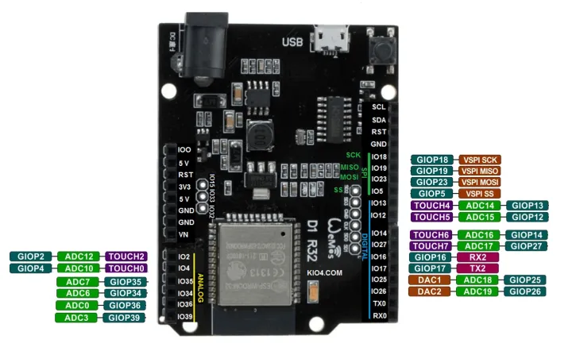

| Microcontroller | ESP32  |
| --------------- | ------ |
| Frequency       | 240MHz |
| Flash           | 4MB    |
| RAM             | 320KB  |

[platformio.ini](https://docs.platformio.org/en/latest/boards/espressif32/wemos_d1_mini32.html)：

```
[env:wemos_d1_mini32]
platform = espressif32
board = wemos_d1_mini32
board_build.f_cpu = 240000000L
```

