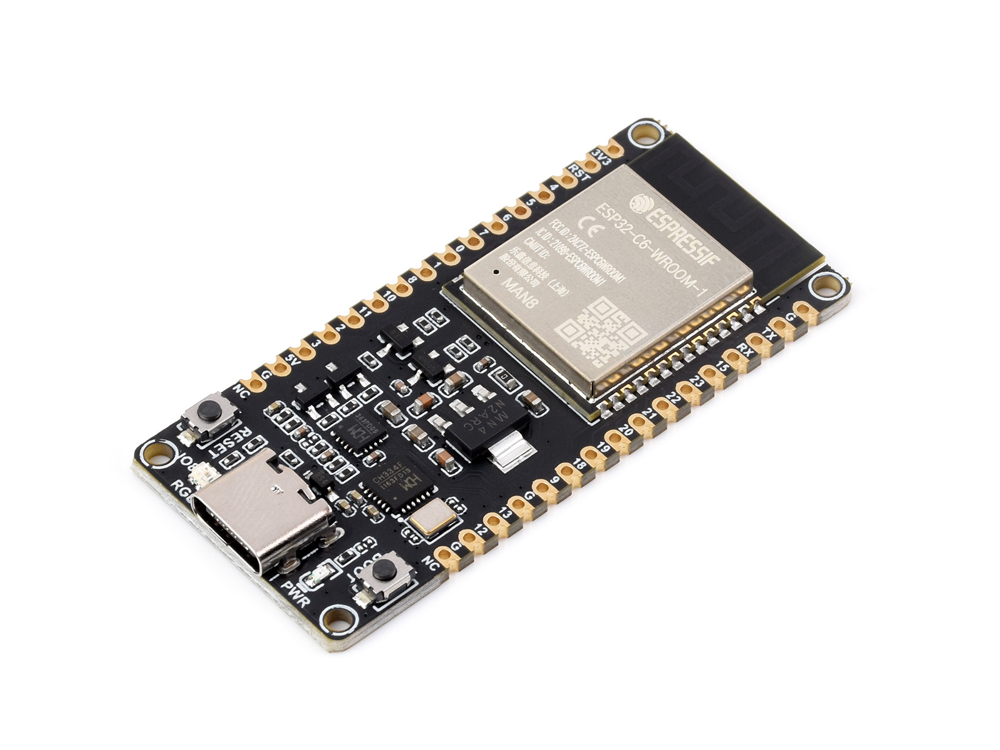
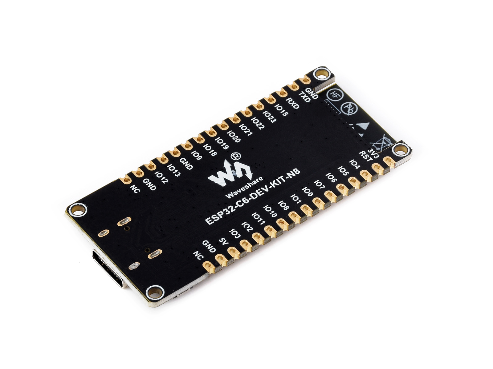
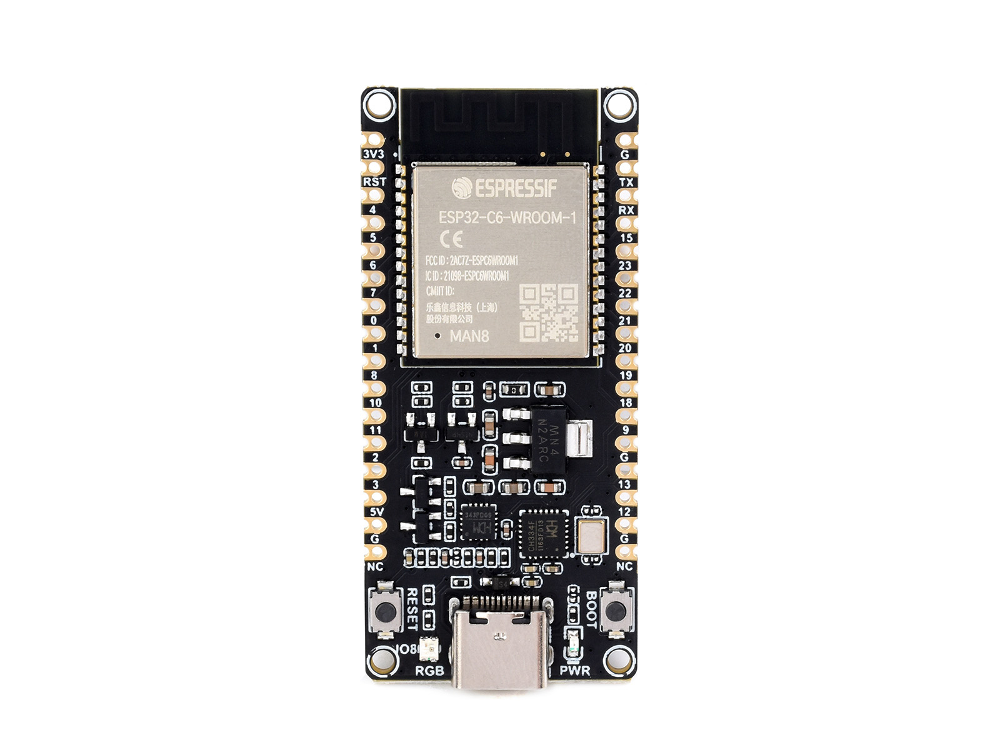
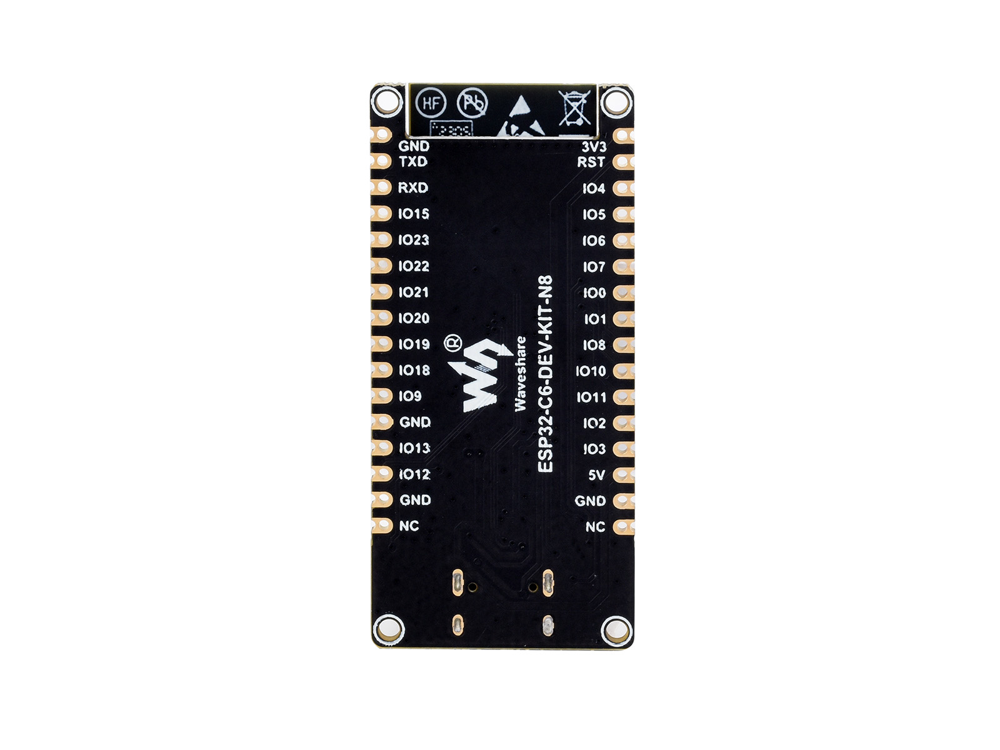
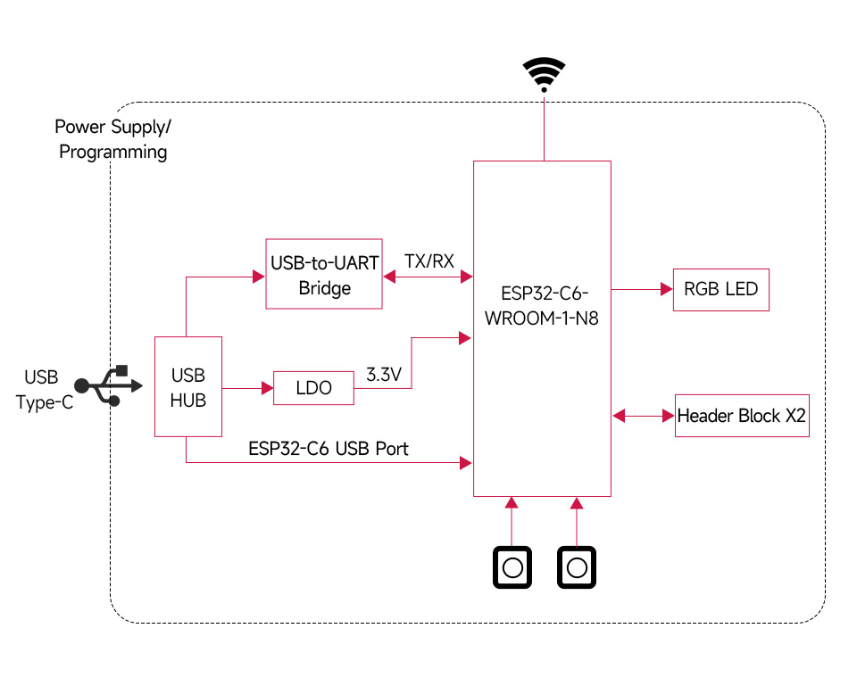
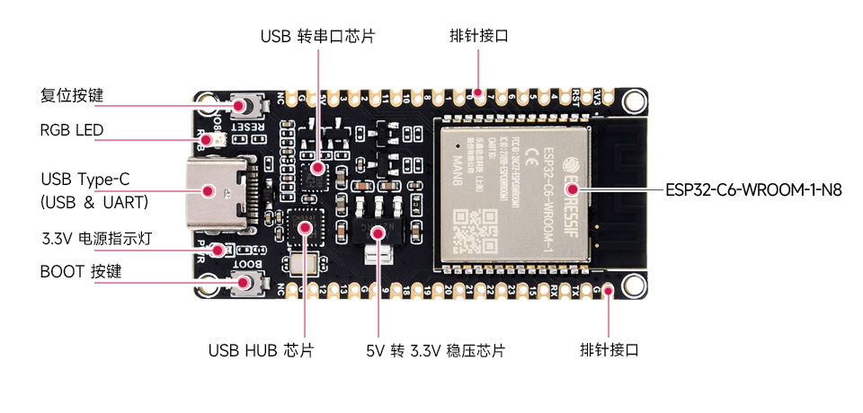
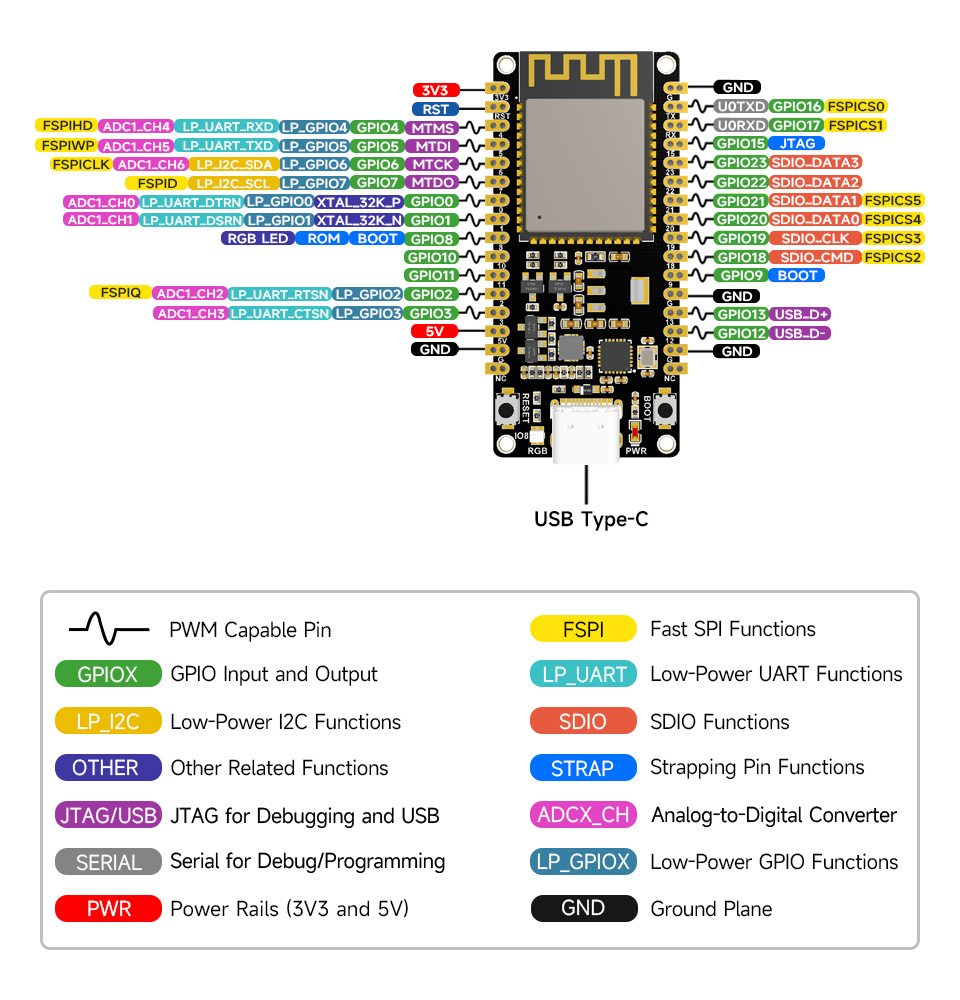
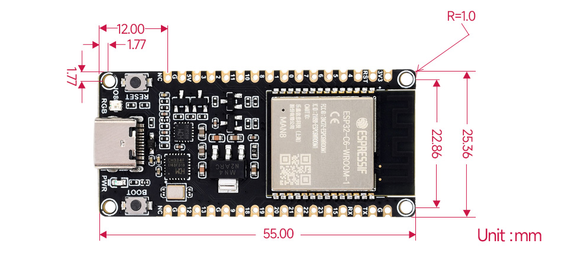

# ESP32-C6-DEV-KIT-N8

ESP32-C6-WROOM-1-N8

* RISC-V 32 单核，160MHz
* 320KB ROM、512KB HP SRAM、16KB LP SRAM、8MB Flash
* WiFi 6、BLE5，IEEE 802.15.4（Zigbee 3.0 & Thread)

|  |  |
| ------------------------------------------------ | ------------------------------------------------ |
|  |  |

## Design

板载 CH343 与 CH334 芯片，通过单个 Type-C 接口就可以满足 USB 和 UART 开发使用需求。

## Resource

## Pinout

引脚兼容乐鑫的 `ESP32-C6-DevKitC-1`。

## Size

## Doc

[中文](https://docs.espressif.com/projects/esp-idf/zh_CN/latest/esp32c6/get-started/index.html) [English](https://docs.espressif.com/projects/esp-idf/en/latest/esp32c6/index.html) 

