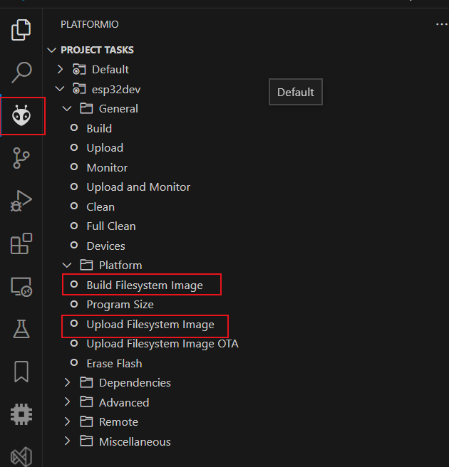
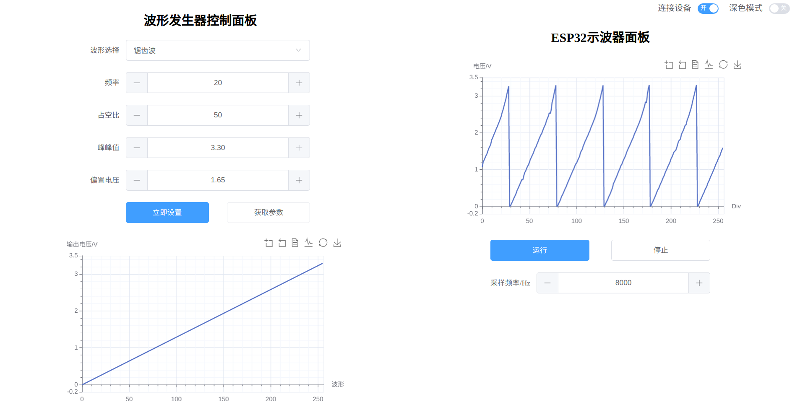
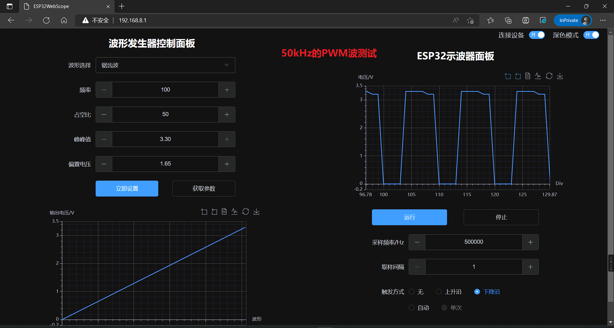

# WebScope

网页示波器+波形发生器

### 特性

波形发生器部分采用硬件定时器中断进行DAC输出的方式，运行在核心1上。实现方法可见`wave_gen.hpp`文件，里面注释很详细。

- 波形发生器频率 0-1500Hz
- 波形种类：正弦波、方波、锯齿波
- 可设置偏置电压与峰峰值
- 默认输出引脚 DAC channel 1 即 GPIO25(ESP32)

示波器部分是通过i2s进行adc采样后发送给上位机显示的，同样也运行在核心1上。每轮采样2048个点，但只取其中256个，取样间隔可通过设置全局变量`sampleStep`来改变。

- 示波器采样率，即I2S采样速率，我在代码里限制为1k~550K
- 默认采样引脚是ADC1_CHANNEL_7，即GPIO35
- 取样间隔调整，相当于波形横轴放大，目前最高4倍，适用于观察低频信号
- 软件触发，目前实现了上升沿/下降沿触发
- 示波器更多功能有待继续添加

通信方面，ESP32在`websocket_init`函数中初始化了一个websocket服务器以及一个http服务器。与通信相关的程序主要运行在核心0上。

http服务器主要提供静态网页托管功能，可以将存放在flash中的web资源发送给客户端，发送完一次静态资源(280kb)大概需要3~5秒。

websocket服务器主要用于同客户端建立 websocket 连接并进行双向通信，客户端通过web界面向ESP32发送指令以更改参数，ESP32则可以主动向客户端发送采样数据及其他信息

额外添加了一个50kHz的PWM信号，用于测试 I2S+ADC 极限采样率下的采样情况，这时候波形跳变较为严重，不过还能看出波形以及正确统计出频率。

### 使用方法

1. 编译并上传data目录下的web资源文件

2. 正常编译下载程序

3. 连接 esp 的热点，在浏览器打开 192.168.8.1 即可

   

