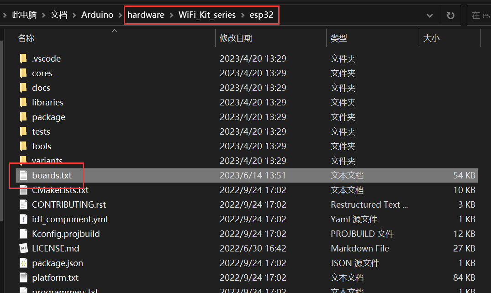

[product](https://heltec.org/product_center/esp-arduino/) ，[github](https://github.com/HelTecAutomation/) ，[docs](https://docs.heltec.org/en/dev_kits/esp32_arduino/index.html) ，[resource](https://resource.heltec.cn/download/) 

# Wireless_Stick_V3

## Arduino

① 下载 SDK（三选一）：

[heltec](https://resource.heltec.cn/download/tools/WiFi_Kit_series.zip) [github(lastest)](https://github.com/Heltec-Aaron-Lee/WiFi_Kit_series) [github(20230614)](https://github.com/uYanki/WiFi_Kit_series) 

② 打开目录

| 首选项              | 项目文件夹位置                                         |
| ------------------- | ------------------------------------------------------ |
|  |  |

③ 新建 hardware 文件夹

④ 解压 WiFi_Kit_series.zip


⑤ 重启 Arduino IDE

⑥ 选择开发板


⑦ 选择示例


⑧ 配置频率段


⑨ 编译上传

## Platformio

① 缺少证书

烧录例程后 OLED 不亮，且串口输出以下内容


② 查询证书

需到 http://www.heltec.cn/search/ 中，填入 ESP32ChipID，：


③ 配置证书

需写在 `Mcu.begin()` 之前


④ 重新烧录

### platformio.ini

#### library(.a)


此部分代码并没有开源（McuClass），被隐藏在 libheltec.a  中了，因此编译时需导入该库。

#### build_flags

```
-D 设置宏定义
-L 增添库目录
-l 导入库
```

| LoRaWanDebugLevel | LoRaWanDebugLevel |
|-------------------|-------------------|
| None              | 0                 |
| Freq              | 1                 |
| Freq && DIO       | 2                 |
| Freq && DIO && PW | 3                 |

| LORAWAN_REGION      | ACTIVE_REGION               |
|---------------------|-----------------------------|
| REGION_EU868        | LORAMAC_REGION_EU868        |
| REGION_EU433        | LORAMAC_REGION_EU433        |
| REGION_CN470        | LORAMAC_REGION_CN470        |
| REGION_US915        | LORAMAC_REGION_US915        |
| REGION_AU915        | LORAMAC_REGION_AU915        |
| REGION_CN779        | LORAMAC_REGION_CN779        |
| REGION_AS923        | LORAMAC_REGION_AS923        |
| REGION_KR920        | LORAMAC_REGION_KR920        |
| REGION_IN865        | LORAMAC_REGION_IN865        |
| REGION_US915_HYBRID | LORAMAC_REGION_US915_HYBRID |

| LORAWAN_DEVEUI     | LORAWAN_DEVEUI_AUTO |
|--------------------|---------------------|
| CUSTOM             | 0                   |
| Generate By ChipID | 1                   |


| LORAWAN_DEVEUI       | LORAWAN_PREAMBLE_LENGTH |
|----------------------|-------------------------|
| 8(default)           | 8                       |
| 16(For M00 and M00L) | 16                      |

| LoRaWanDebugLevel | LoRaWAN_DEBUG_LEVEL |
|-------------------|---------------------|
| None              | 0                   |
| Freq              | 1                   |
| Freq && DIO       | 2                   |
| Freq && DIO && PW | 3                   |

Q：为什么要这样配置？

① boards.txt




defines：定义宏

extra_libs：导入库

② arduino

开启编译输出，编译项目，查看编译信息即可

