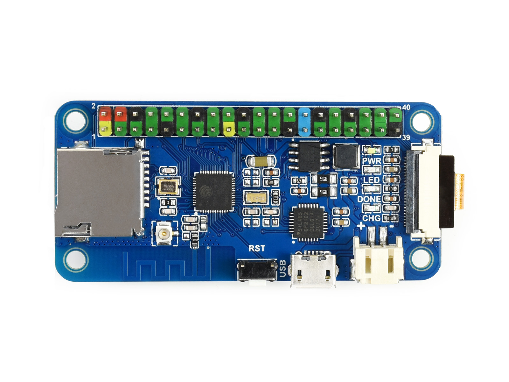
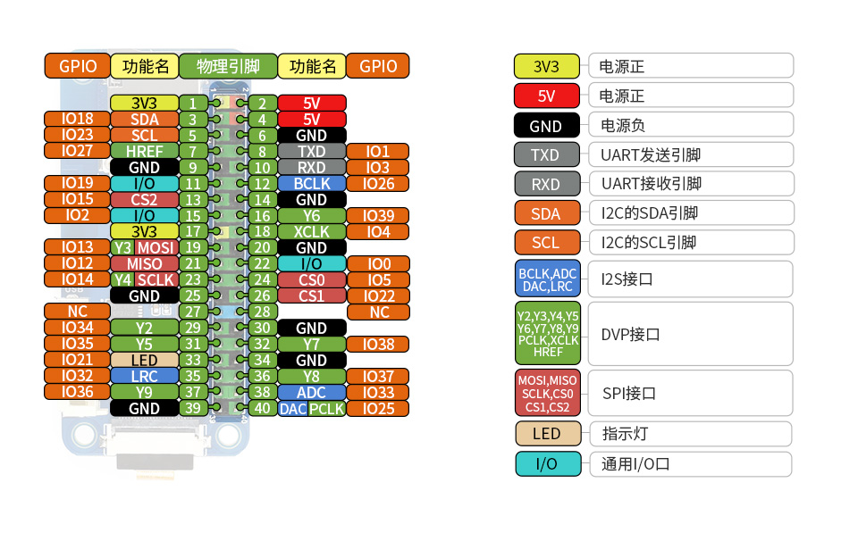

## Preview

|  |  |
| ------------------------------------------ | ------------------------------------------ |
|  |  |
|  |  |

## Board

|               | 说明                                               |
| ------------- | -------------------------------------------------- |
| **WiFi 标准** | 802.11b/g/n                                        |
| **蓝牙标准**  | 蓝牙 4.2，包含传统蓝牙 (BR/EDR) 和低功耗蓝牙 (BLE) |
| **处理器**    | Xtensa LX6 双核处理器@240MHz                       |
| **摄像头**    | OV2640 (UXGA 1622×1200) (仅含摄像头版本)           |
| **SRAM**      | 520KB+8MB                                          |
| **输入电压**  | 3.3V~5V                                            |
| **充电电流**  | 1A@5V                                              |
| **产品尺寸**  | 65mm × 30.5mm                                      |
| **闪存**      | 448KB+4MB                                          |
| **工作电压**  | 3.3V                                               |
| **整机耗流**  | 7.7mA@5V (ESP32 深度睡眠)                          |
| **工作温度**  | -40℃ ~ 85℃                                         |

## Resource

器件介绍

1. ESP32-D0WDQ6-V3 芯片

2. 40MHz 无源晶振

3. 复位按键

4. CP2102：USB 转 UART 芯片

5. 状态指示灯

   PWR 电源指示灯
   LED PWM 控制指示灯
   DONE 锂电池充电完成指示灯
   CHG 锂电池充电指示灯

6. CS8501 锂电池充电管理芯片

7. 32.768KHz 无源晶振

8. OV2640：摄像头，200 万像素 (UXGA 1622×1200)

9. MSM261S4030H0R 数字麦克风：灵敏度 -26dBFS @1kHz 1Pa

10. RT9166A-28PXL 电源芯片

11. RT9193-33 电源芯片

12. RT9166A-12PXL 电源芯片

13. ESP-PSRAM64H 内存芯片

14. W25Q32JVSSIQ 闪存芯片

核心接口简介

1. **Raspberry Pi GPIO 接口**

   适用于树莓派扩展板系列

2. Micro SD 卡座子

3. IPEX 天线座子

4. USB TO UART 接口

5. **4.2V 锂电池接口**

   PH2.0 接口单节锂电池

6. **DVP 摄像头接口**

## PinOut

## Size

## [Arduino-Doc](https://docs.espressif.com/projects/arduino-esp32/en/latest/index.html)

