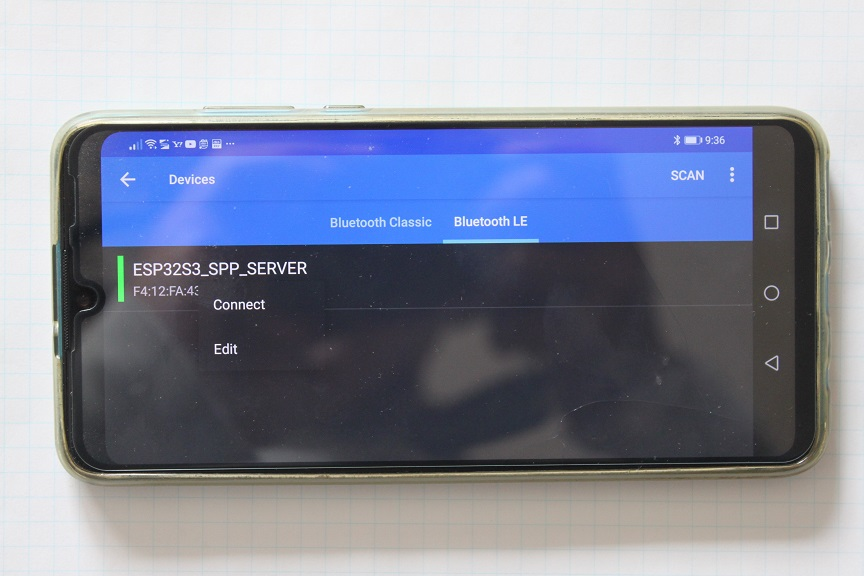
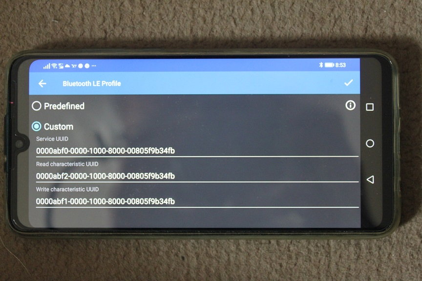
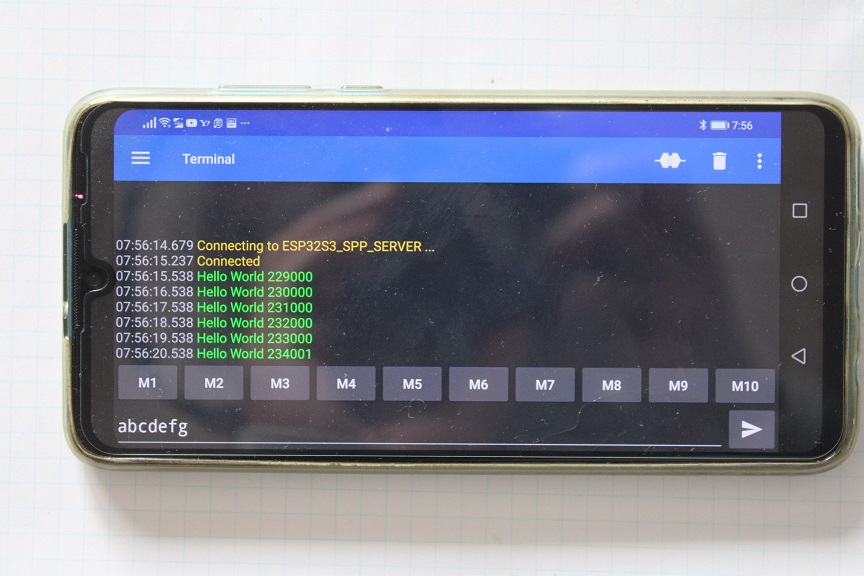

# For ble 4.2

- For ESP32, pair with ESP32_SPP_SERVER   
- For ESP32S3, pair with ESP32S3_SPP_SERVER   
- For ESP32C2, pair with ESP32C2_SPP_SERVER   
- For ESP32C3, pair with ESP32C3_SPP_SERVER   
- For ESP32C6, pair with ESP32C6_SPP_SERVER   
- Launch the app and select device  
Menu->Devices->Bluetooth LE   
- Long press the device and select the Edit menu   

- Select Custom and specify UUID （点击对应条目就弹出选项的，不需要手动填写）
  

- Connect to device   
You can communicate to UNO using android.   

