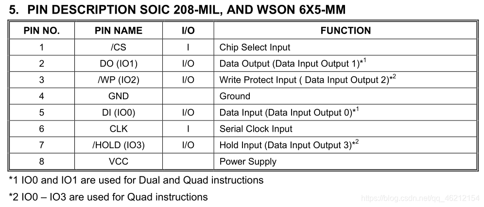

SPI Flash programmer
====================

This is a very simple Arduino sketch and Python 3 client to program SPI flash chips. It's probably not very nice or tolerant, but it does at least have error correction and fast verification.

The requirements are [pySerial](https://github.com/pyserial/pyserial) and [clint](https://github.com/kennethreitz/clint). Both modules can be installed with [pip](https://pip.pypa.io/en/stable/installing/):

```bash
python -m pip install pyserial clint
```

Flash Pins
-----------------




Commands
-------

```bash
# Listing serial ports
> python spi_flash_programmer_client.py ports
0: COM4
Done

# Help text
> python spi_flash_programmer_client.py -h
usage: spi_flash_programmer_client.py [-h] [-d DEVICE] [-f FILENAME]
                                      [-l LENGTH] [--rate BAUD_RATE]
                                      [--flash-offset FLASH_OFFSET]
                                      [--file-offset FILE_OFFSET] [--pad PAD]
                                      [--debug {off,normal,verbose}] [--io IO]
                                      [--value VALUE]
                                      {ports,write,read,verify,erase,enable-protection,disable-protection,check-protection,status-register,id-register,set-cs-io,set-output}

Interface with an Arduino-based SPI flash programmer

positional arguments:
  {ports,write,read,verify,erase,enable-protection,disable-protection,check-protection,status-register,id-register,set-cs-io,set-output}
                        command to execute

optional arguments:
  -h, --help            show this help message and exit
  -d DEVICE             serial port to communicate with
  -f FILENAME           file to read from / write to
  -l LENGTH             length to read/write in bytes, use -1 to write entire
                        file
  --rate BAUD_RATE      baud-rate of serial connection
  --flash-offset FLASH_OFFSET
                        offset for flash read/write in bytes
  --file-offset FILE_OFFSET
                        offset for file read/write in bytes
  --pad PAD             pad value if file is not algined with SECTOR_SIZE
  --debug {off,normal,verbose}
                        enable debug output
  --io IO               IO pin used for set-cs-io and set-output
  --value VALUE         value used for set-output

# Read chip id (W25Q64)
> python spi_flash_programmer_client.py -d COM4 id-register
Connected to 'SPI Flash programmer v1.0'
00000000: EF 40 17

# Read flash
> python spi_flash_programmer_client.py -d COM4 -l 4096 -f dump.bin read
Connected to 'SPI Flash programmer v1.0'
....

# Write flash (sectors are erased automatically)
> python spi_flash_programmer_client.py -d COM4 -l 4096 -f dump.bin write
Connected to 'SPI Flash programmer v1.0'
....

# Verify flash
> python spi_flash_programmer_client.py -d COM4 -l 4096 -f dump.bin verify
Connected to 'SPI Flash programmer v1.0'
....

# Erase flash
> python spi_flash_programmer_client.py -d COM4 -l 4096 erase
Connected to 'SPI Flash programmer v1.0'
[###########                     ] 383/1024 - 00:01:13

# Set IO Pin value
# Example: IO pin 0x2, set to LOW
> python spi_flash_programmer_client.py -d COM4 --io 0x2 --value 0x0 set-output

# Override ChipSelect pin
# Example: use IO pin 13/0xd
> python spi_flash_programmer_client.py -d COM4 --io 0xd set-cs-io
```


