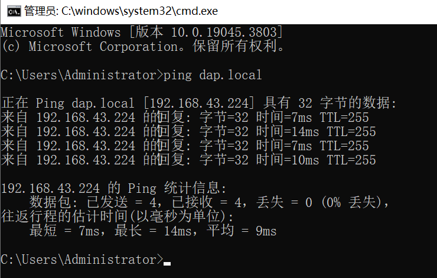
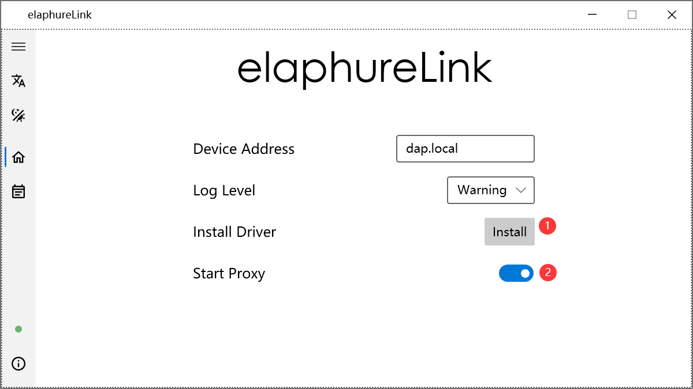
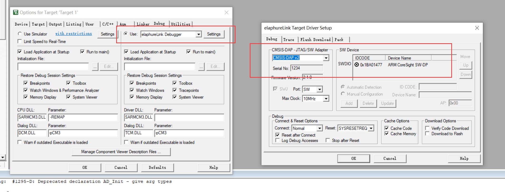
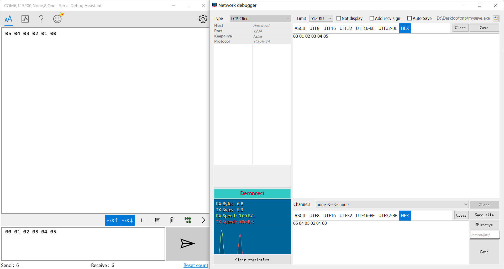

# [无线 DAPLink](https://kkgithub.com/windowsair/wireless-esp8266-dap)

## Usage

① 电脑 和 无线DAP 连接相同的 WiFi 热点。

（在 `wifi_configuration.h` 中配置 ssid 和 password）

② 通讯测试：电脑 命令行 执行 `ping dap.local`，如下所示表示已和 无线DAP 通讯上。



③ 在 `tools\elaphureLink` 中设置代理 



④ 在 `keil` 中选择调试器



## Feature

1. SoC Compatibility
   - [x] ESP8266/8285
   - [x] ESP32
   - [x] ESP32C3
   - [x] ESP32S3

2. Debug Communication Mode
   - [x] SWD
   - [x] JTAG

3. USB Communication Mode
   - [x] USB-HID
   - [x] WCID & WinUSB (Default)

4. Debug Trace (Uart)
   - [x] Uart TCP Bridge

5. More..
   - [x] SWD protocol based on SPI acceleration (Up to 40MHz)
   - [x] Support for [elaphureLink](https://github.com/windowsair/elaphureLink), fast Keil debug without drivers
   - [x] Support for [elaphure-dap.js](https://github.com/windowsair/elaphure-dap.js), online ARM Cortex-M firmware flash
   - [x] Support for OpenOCD/pyOCD
   - [x] ...

## Pins


<details>
<summary>ESP8266</summary>


| SWD   |        |
| ----- | ------ |
| SWCLK | GPIO14 |
| SWDIO | GPIO13 |
| TVCC  | 3V3    |
| GND   | GND    |


--------------


| JTAG               |         |
| ------------------ | ------- |
| TCK                | GPIO14  |
| TMS                | GPIO13  |
| TDI                | GPIO4   |
| TDO                | GPIO16  |
| nTRST \(optional\) | GPIO0\* |
| nRESET             | GPIO5   |
| TVCC               | 3V3     |
| GND                | GND     |

--------------

| Other             |               |
| ----------------- | ------------- |
| LED\_WIFI\_STATUS | GPIO15        |
| Tx                | GPIO2         |
| Rx                | GPIO3 (U0RXD) |

> Rx and Tx is used for uart bridge, not enabled by default.

</details>


<details>
<summary>ESP32</summary>


| SWD   |        |
| ----- | ------ |
| SWCLK | GPIO14 |
| SWDIO | GPIO13 |
| TVCC  | 3V3    |
| GND   | GND    |


--------------


| JTAG               |        |
| ------------------ | ------ |
| TCK                | GPIO14 |
| TMS                | GPIO13 |
| TDI                | GPIO18 |
| TDO                | GPIO19 |
| nTRST \(optional\) | GPIO25 |
| nRESET             | GPIO26 |
| TVCC               | 3V3    |
| GND                | GND    |

--------------

| Other             |        |
| ----------------- | ------ |
| LED\_WIFI\_STATUS | GPIO27 |
| Tx                | GPIO23 |
| Rx                | GPIO22 |


> Rx and Tx is used for uart bridge, not enabled by default.


</details>


<details>
<summary>ESP32C3</summary>


| SWD   |       |
| ----- | ----- |
| SWCLK | GPIO6 |
| SWDIO | GPIO7 |
| TVCC  | 3V3   |
| GND   | GND   |


--------------


| JTAG               |       |
| ------------------ | ----- |
| TCK                | GPIO6 |
| TMS                | GPIO7 |
| TDI                | GPIO9 |
| TDO                | GPIO8 |
| nTRST \(optional\) | GPIO4 |
| nRESET             | GPIO5 |
| TVCC               | 3V3   |
| GND                | GND   |

--------------

| Other             |        |
| ----------------- | ------ |
| LED\_WIFI\_STATUS | GPIO10 |
| Tx                | GPIO19 |
| Rx                | GPIO18 |


> Rx and Tx is used for uart bridge, not enabled by default.


</details>


<details>
<summary>ESP32S3</summary>


| SWD   |        |
| ----- | ------ |
| SWCLK | GPIO12 |
| SWDIO | GPIO11 |
| TVCC  | 3V3    |
| GND   | GND    |


--------------


| JTAG               |        |
| ------------------ | ------ |
| TCK                | GPIO12 |
| TMS                | GPIO11 |
| TDI                | GPIO10 |
| TDO                | GPIO9  |
| nTRST \(optional\) | GPIO14 |
| nRESET             | GPIO13 |
| TVCC               | 3V3    |
| GND                | GND    |

</details>

## Uart TCP Bridge

详细开启方法请查看[原项目文档](README_OrgProj.md)。

```
		|	 WirelessDAP    |
PC   -> |  TCP  ->  Uart TX | -> external device
PC   <- |  TCP  <-  Uart Rx | <- external device
```



## Build

esp-idf v4.4.2 ok

esp-idf v4.4.4 ok

