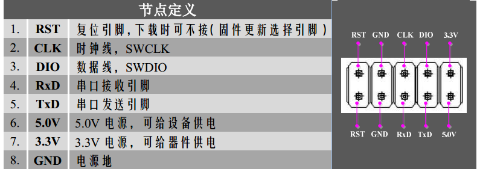
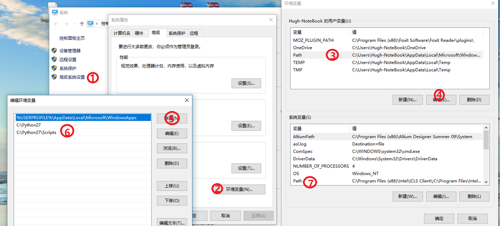
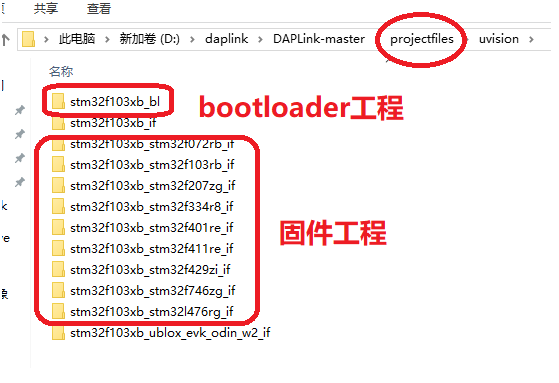
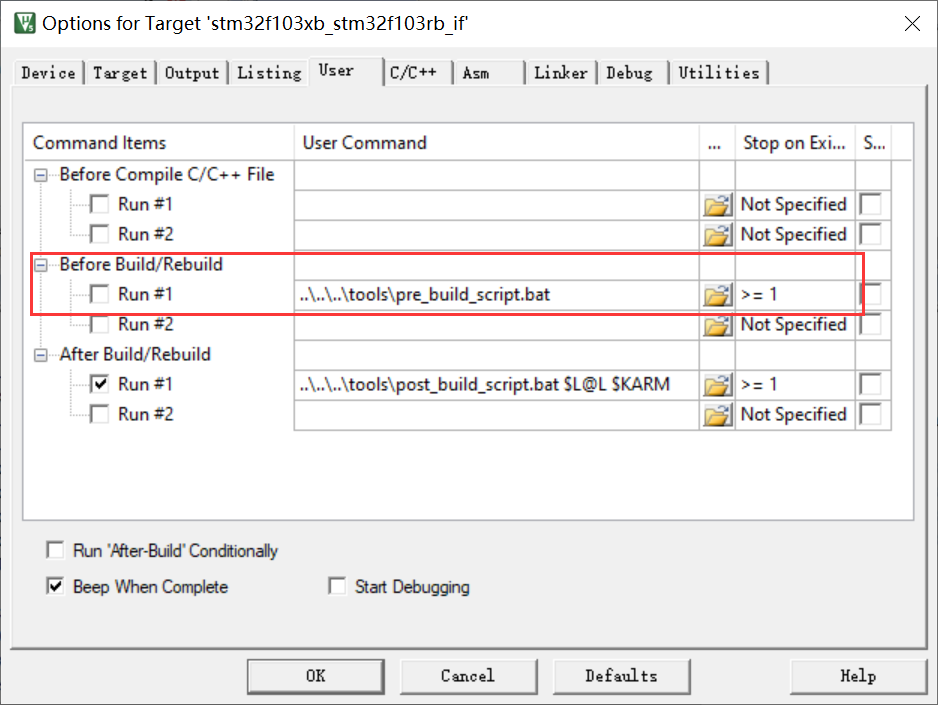
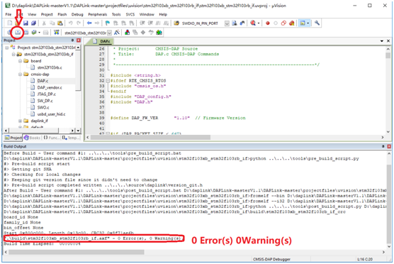

## DAPLink

### 功能介绍

这是一款ARM官方开源的仿真器，可以实现全系列 Cortex-M0/M3/M4/M7 内核芯片的程序下载和调试。特性如下：

- **a.官方开源，无版权限制，稳定不丢失固件**
- **b.SWD接口，全系列Cortex-M0/M3/M4/M7下载和调试（HID）**
- **c.自带USB虚拟串口，方便程序调试（CDC）**
- **d.拖拽下载功能，模拟U盘，将Hex或bin格式文件拖拽或拷贝至U盘完成下载(MSC)**
- **e.串口下载程序，改进官方程序实现（串口ISP）**
- **f.输出5.0V电源，可供电目标电路**
- **g.输出3.3V电源，可供电目标器件**
- **h.板载自恢复保险丝，短路自保护**
- **i.Win10即插即用，无需驱动**

### 接口及尺寸

产品上下共计8个插针，其中上面四个插针为下载调试接口，下面四个插针为串口通讯接口。具体引脚如下所示：



## 官方固件

### 环境搭建

包括下面这些必备的软件，软件包含在资料包中，也可以自己网上下载：

- 1.python2.7 (添加环境变量) 



- 2.Git
- 3.MDK5.25
- 4.pip  

### 编译烧录

下载[官方源代码](https://github.com/ARMmbed/DAPLink)，执行 `tools` 目录下的`build_release.bat`。

会在源码目录中的 `Projectfiles` 将分别生成bootloader工程和固件工程。



打开任意工程，取消于编译前的 git 版本获取：



在 `source\daplink` 添加文件 `version_git.h`，定义版本相关宏（任意值）。

```c
#ifndef version_git
#define version_git

#define GIT_DESCRIPTION "11223344"
#define GIT_COMMIT_SHA  "44332211"

#endif  
```

编译 bootloader  和 daplink 工程。

烧录 bootloader 后会出现 U盘设备，将 daplink 固件拖入即烧录完成。




