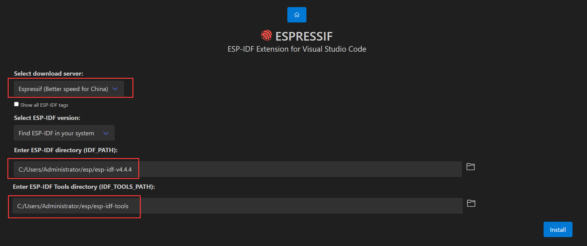

# 环境安装

注意路径中的斜杠方向，反了会导致 CMakelist 解析错误，从而导致编译失败。



# 错误处理

##  esp_core_dump_flash

**报错**：esp_core_dump_flash: Core dump flash config is corrupted

**原因**：缺少分区文件

**解决方法**：

新建 `partitions.csv` ，并写入：

```
# Name,   	Type, 	SubType, 	Offset,		Size,	Flags
nvs,		data,	nvs,		0x9000,		0x6000,
phy_init,	data,	phy,		0xf000,		0x1000,
factory,	app,	factory,	0x10000,	1M,
storage,	data,	spiffs,		0x110000,	0x2f0000,
```

往 `platformio.ini` 中添加：

```
board_build.partitions = partitions.csv
```

重新编译烧录即可。

② 

GPIO can only be used as input mode

