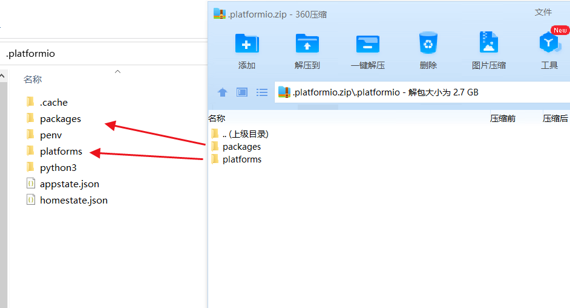
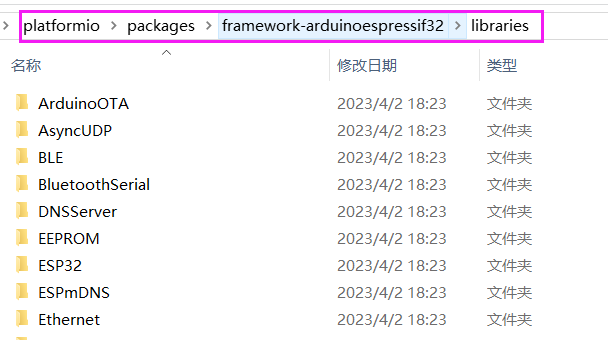
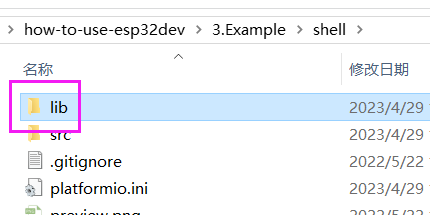

# 安装

由于国内的 esp sdk 安装过慢，因此在安装 pio 之后，把 `.platformio.zip` 解压到下面的文件夹即可。

`yourUserName` 为计算机的用户名。

```
C:\Users\yourUserName\.platformio
C:\Users\Administrator\.platformio
```



# 库文件

### 外部库

**库的构成**：

```c
├─examples // 示例工程（不参与编译）
│  ├─eeprom_class
│  ├─eeprom_extra
│  └─eeprom_write
└─src // 库的头文件及源文件（参与编译）
```

**库的添加**：

* 全局库

将库文件放至目标框架的 `libraries` 文件夹中：

```
.platformio\packages\framework-arduinoespressif32\libraries\
```



* 工程库

将库文件放至工程目录下的 `lib` 文件夹中：



